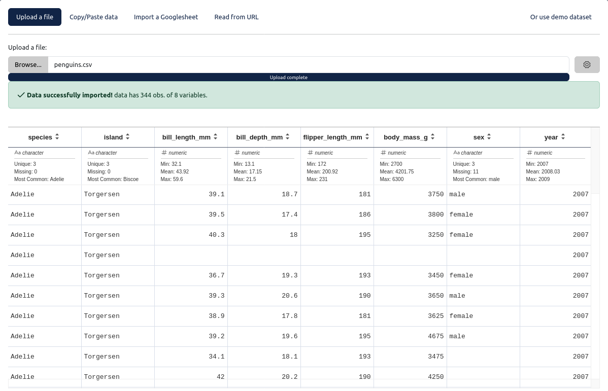
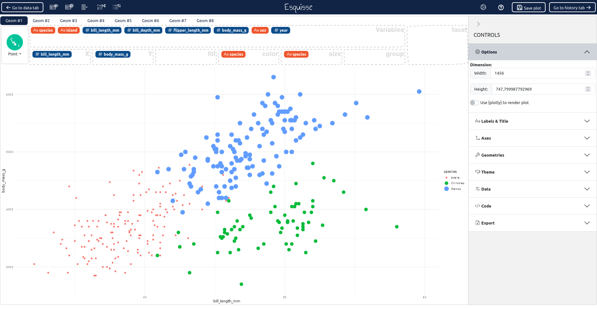
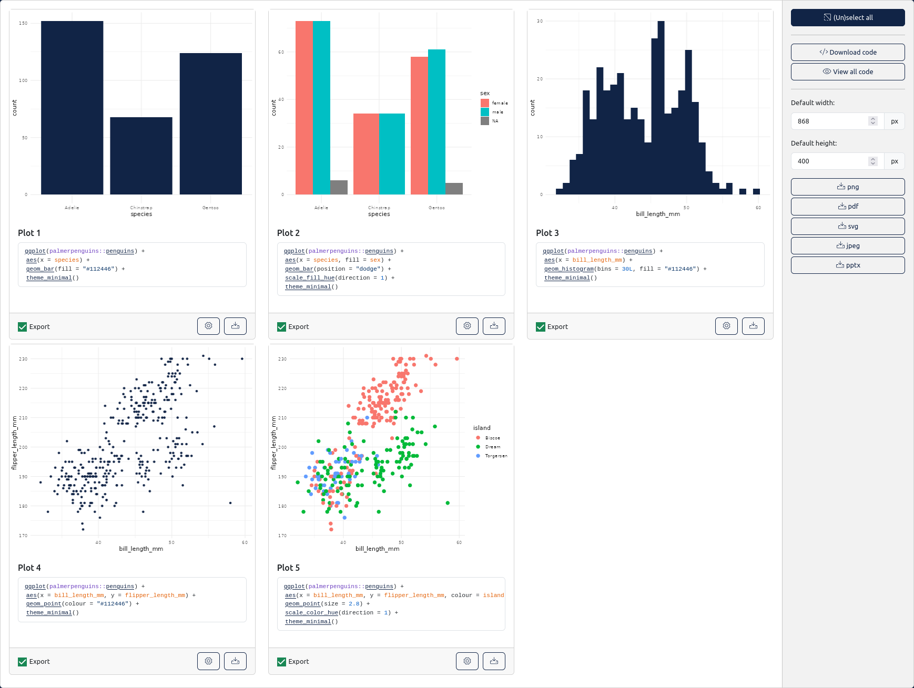

  

<h3 align="center">
  Create graphics with {ggplot2} with ease
</h3>

 

A web interface to create graphics with [{ggplot2}](https://github.com/tidyverse/ggplot2) package based on [{esquisse}](https://github.com/dreamRs/esquisse).

Application is available here : https://dreamrs.shinyapps.io/esquisse/

## Features

### Import data

Import data from various format:

* from a text file (.txt, .csv, ...) or an Excel file
* by copying and pasting data
* from a Google Sheet
* from an URL

Or you can also use a demo dataset.

### Create graphics

Create graphics by dragging variables into aesthetics boxes.

Save the graphs you want to find them in the history tab.

### Export graphics and code

All saved graphics are available here, you export the ones you want and retrieve their code.

