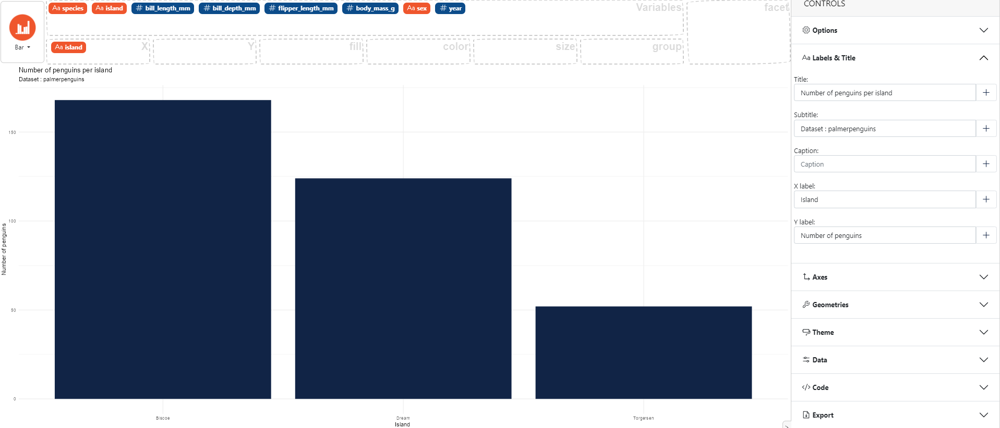

### How to add labels and title

In the control panel on the right select **Labels & Title**, then
you can fill in the fields : *Title*, *Subtitle*, *Caption*, *X label* or *Y label*.
Modifications appear instantly on the graph on the left.

Here an example using the `palmerpenguins` dataset. 

