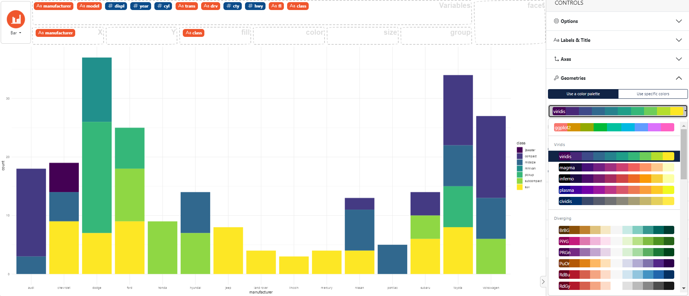

### How to change color palette

In the control panel on the right select **Geometries**, then click on the **Use a color palette** button. 
Many palettes are available.

Here an example using the `mpg` dataset with the *viridis* palette. 

