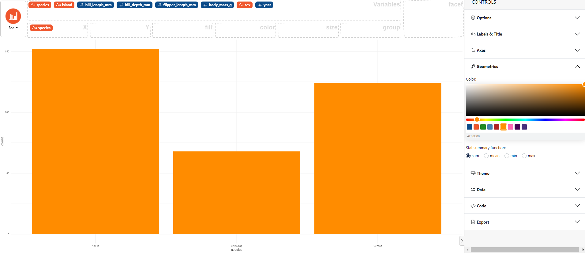

### How to change the graph color

In the control panel on the right select **Geometries**, then choose the desired color from the color picker. 

Here an example using the `palmerpenguins` dataset with the orange color. 

