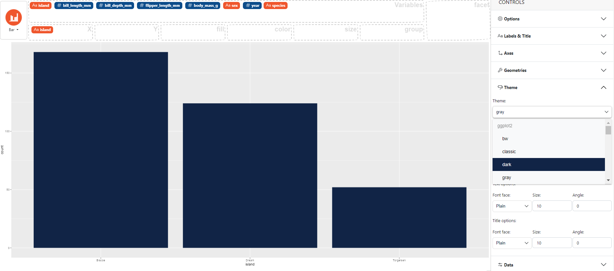

### How to change the theme

In the control panel on the right select **Theme**, then choose the desired theme from the drop-down menu below "Theme". 
Available themes are from {ggplot2} and {ggthemes}.

Here an example using the `palmerpenguins` dataset with the *dark* theme. 

