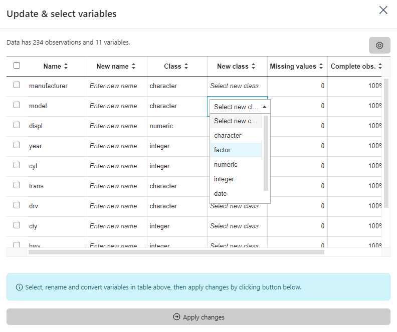

### How to convert a variable

In the menu located on the title bar, select the second icon **Update variable**. 

Then in the modal window, convert the chosen variable by selecting a new class from the drop-down menu associated with this variable in the column "New class".
Finally, click on the button below the table to apply changes.

Here an example using the `mpg` dataset.

