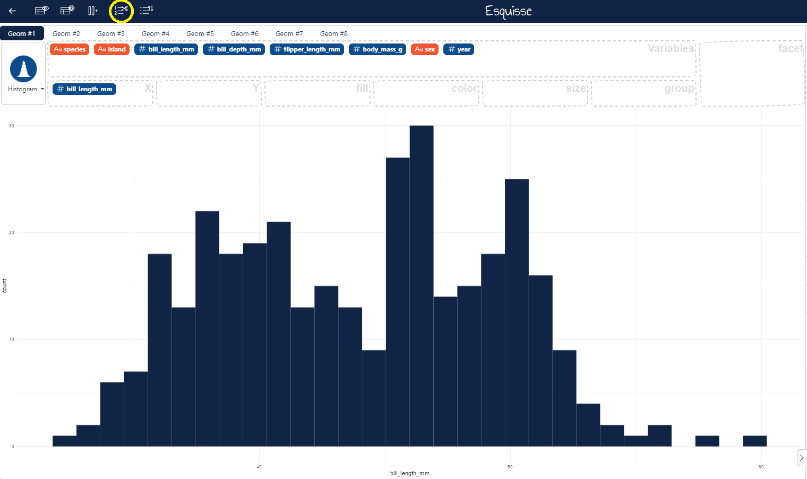
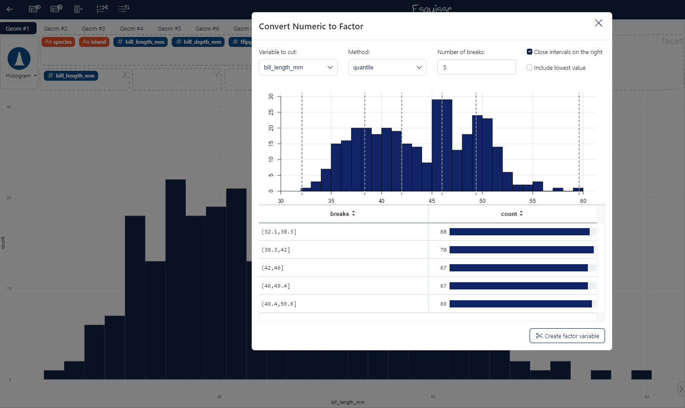
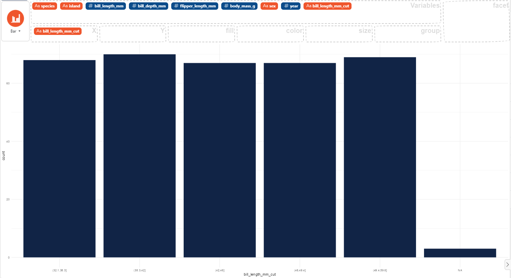

### How to cut numeric variable into factor

In the menu located on the title bar, select the the fourth icon **Cut numeric variable into factor**. 

Then in the modal window, choose the numeric variable to cut. 
You can choose the cut method in the drop down menu, the number of breaks and include or not the lowest value.
Finally, click on the button "Create factor variable" below the table to create the new factor variable.

In the variable slot above the graph you can see the newly created variable `bill_length_mm_cut`, this has the numeric variable name followed by the suffix "_cut".

Here an example using the `palmerpenguins` dataset.
