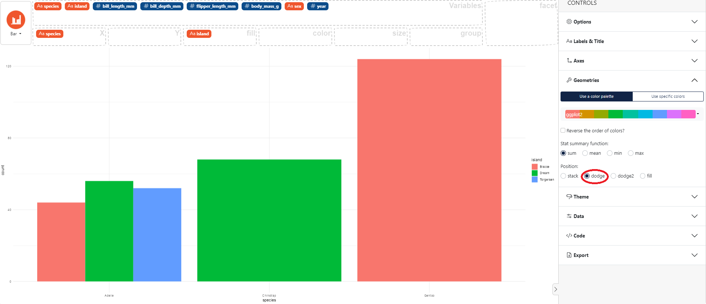

### How to dodge position in a bar chart

In the control panel on the right then select **Geometries**, then choose the "dodge" **Position**. 

Here an example using the `palmerpenguins` dataset with the *dodge* position. 

