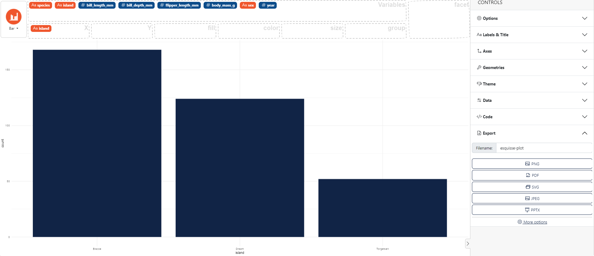
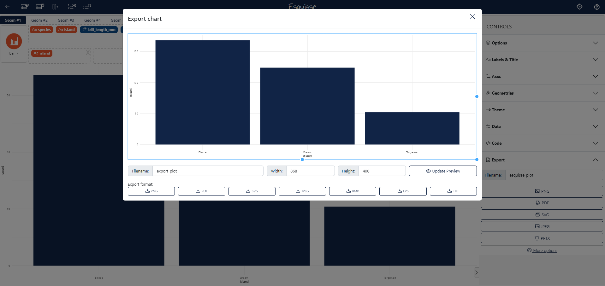

### How to export the graph

In the control panel on the right select **Export**, then you can choose the filename and the export format.

You can also click on the link "More options" below, then in the modal window you can parameter more export options like the "Width" and the "Height" for example. 

Here an example using the `palmerpenguins` dataset. 
