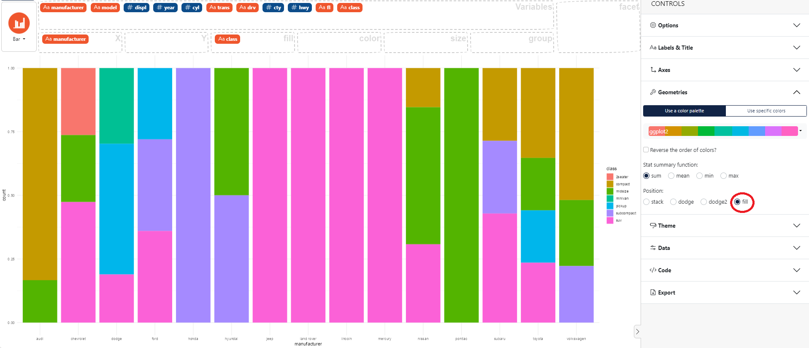

### How to fill position in a bar chart

In the control panel on the right select **Geometries**, then choose the "fill" **Position**. 

Here an example using the `mpg` dataset with the *fill* position. 

