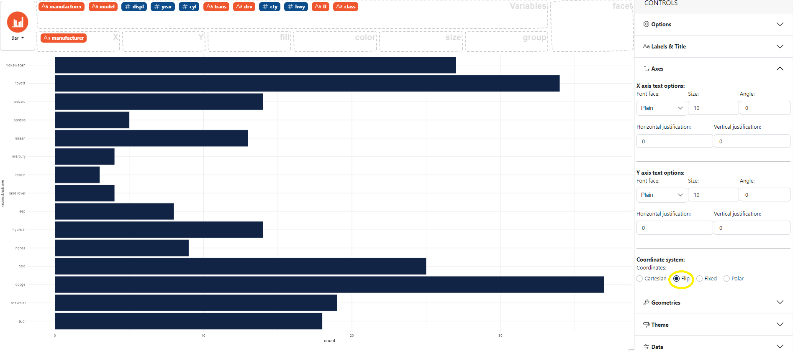

### How to flip position in a bar chart

In the control panel on the right select **Axes**, then in **Coordinate system** choose **Flip**. 

Here an example using the `mpg` dataset with the *flip* position. 

