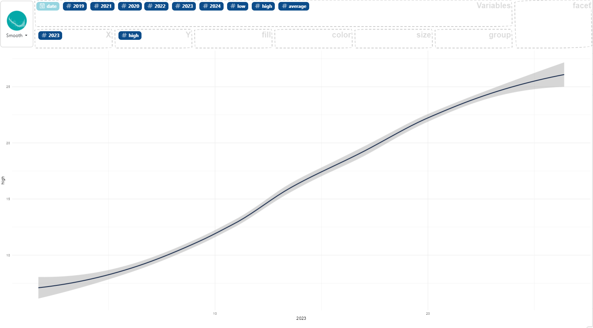

### How to make a smooth line

First, you need two numerical variables in your data, then :

- select the first variable and drag it to the "X" box for use on the x-axis,
- select the second variable and drag it to the "Y" box for use on the stacked surface.

Here an example using the `data enedis` dataset:

