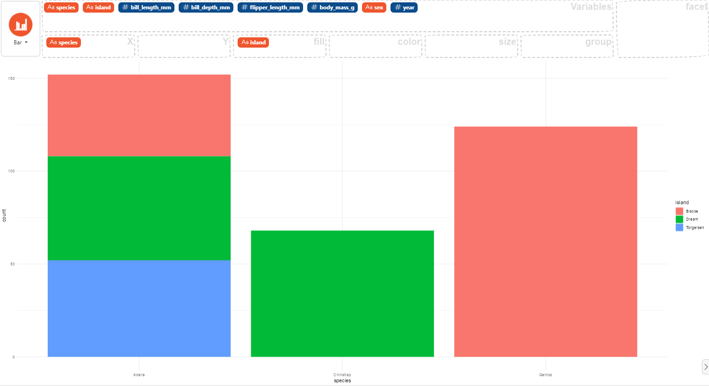

### How to make a stacked bar chart

First, you need two categorical variables in your data, then:

- select the first variable and drag it to the "X" box for use on the x-axis,
- select the second variable and drag it to the "fill" box for use on the stacked surface.

Here an example using the `palmerpenguins` dataset:

