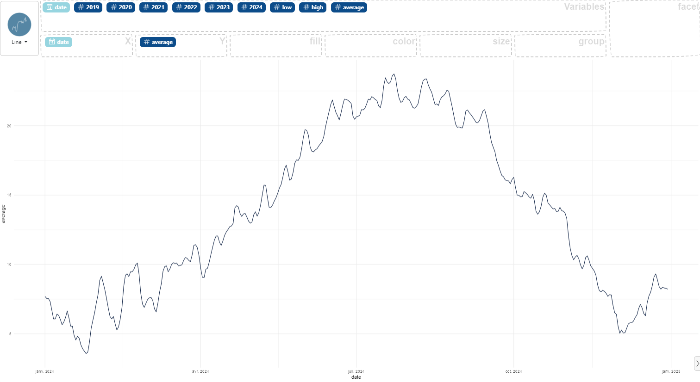

### How to make a time serie

First, you need one date variable and one numerical variable in your data, then:

- select the first variable and drag it to the "X" box for use on the x-axis,
- select the second variable and drag it to the "Y" box for use on the y-axis.

Here an example using the `data enedis` dataset:

