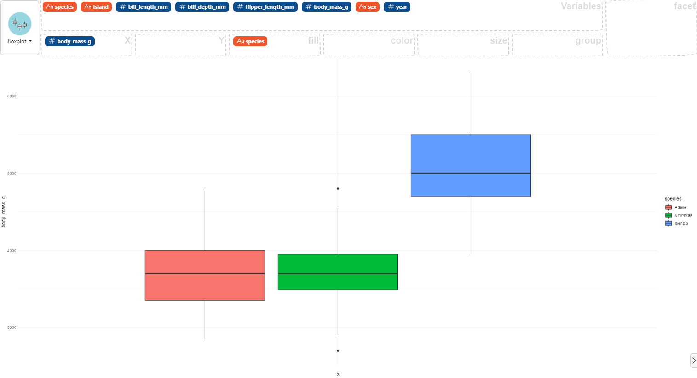

### How to make multiple box plots

First, you need a numerical variable and a categorical variable in your data then:

- select the numerical variable and drag it to the "X" box for use on the x-axis,
- select the categorical variable and drag it to the "fill" to create multiples box plots (one by level).

Here an example using the `palmerpenguins` dataset:

