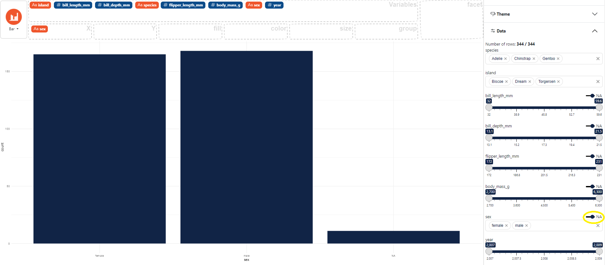
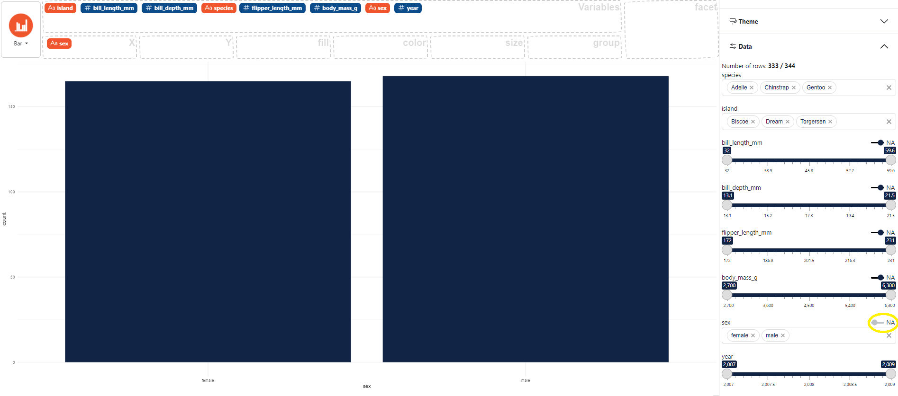

### How to remove NA

In the control panel on the right select **Data**, 
then use the **NA** button to choose whether or not to display the NA values for each variable. 

Here an example using the `palmerpenguins` dataset with the NA removed for the `sex` variable. 

