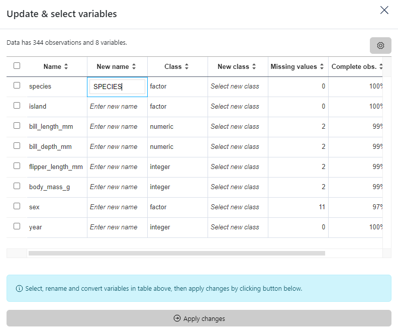

### How to rename a variable

In the menu located on the title bar, select the second icon **Update variable**. 

Then in the modal window, rename the chosen variable by entering a new name in the column "New class".
Finally, click on the button below the table to apply changes.

Here an example using the `palmerpenguins` dataset.

