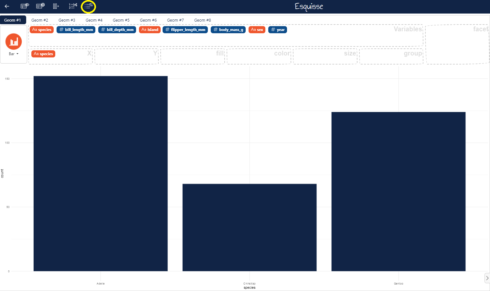
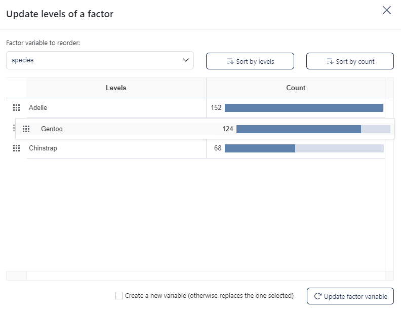
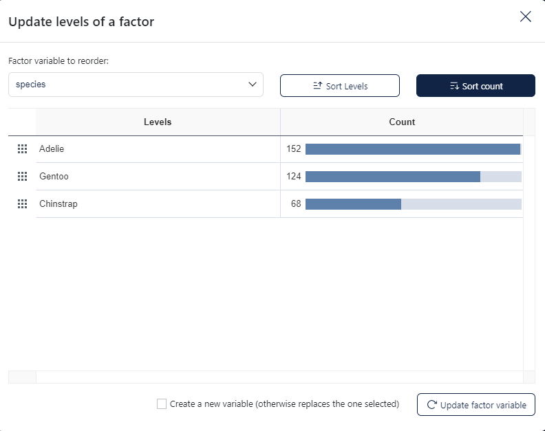
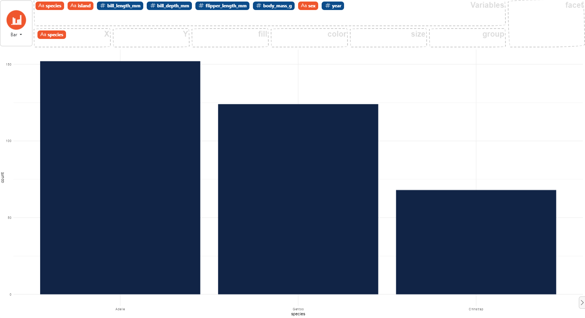

### How to reorder factors

In the menu located on the title bar, select the the fifth icon **Update factor**. 

Then in the modal window, choose the factor variable to reorder. You can reorder levels by **drag and drop**.

You can also reorder levels sorting by **levels** or by **count**.

You can choose to create a new variable or replace the one selected (by default).
Finally, click on the button "Update factor variable" below the table to apply changes.

Here an example using the `palmerpenguins` dataset.

