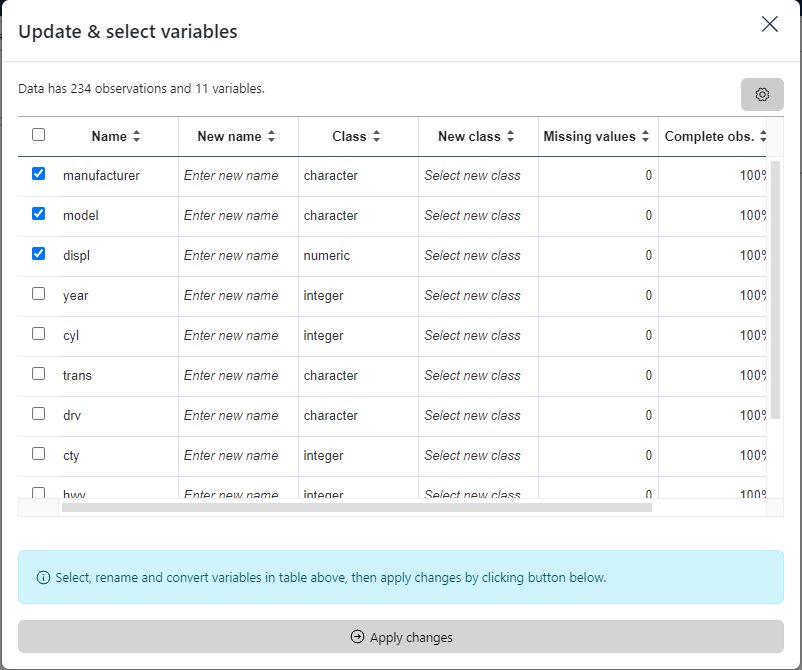

### How to select a variable

In the menu located on the title bar, select the second icon **Update variable**. 

Then in the modal window, check the variables to select in the **Name** column.
Finally, click on the button below the table to apply changes.

Here an example using the `mpg` dataset.

